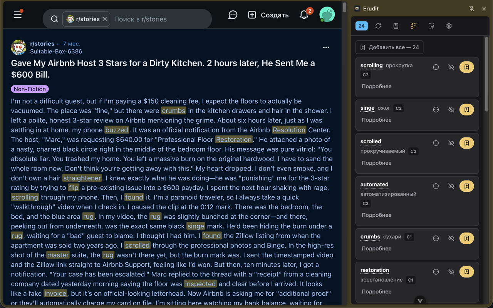

<div align="center">


# Erudit

**Остаётесь в оригинале. Видите только слова, которые действительно выше вашего уровня.**

[](LICENSE)
[](manifest.config.ts)
[](#установка)
[](src/locales)

[English](README.md) · **Русский**

</div>

Erudit — браузерное расширение (Manifest V3, Chrome и Firefox). Оно читает страницу, находит
слова и фразы выше вашего уровня CEFR, переводит их, подсвечивает прямо в тексте и складывает
в словарь с интервальными повторениями и экспортом в Anki.

Подойдёт любая страница с текстом — статья, тред на реддите, глава новеллы, — и только на тех
сайтах, которые вы разрешили сами.

> **Версия 0.0.1.** В магазинах расширений пока нет, ставится из исходников. Всё описанное ниже
> работает; чего не хватает — в разделе [«Планы»](#планы).

<!-- Скриншоты. Как появятся файлы, заменить блок ниже на:
<p align="center">
  
</p>
Требования к кадрам — landing/img/README.md
-->

<div align="center">
<i>Скриншоты готовятся — список нужных кадров в <a href="landing/img/README.md">landing/img/README.md</a>.</i>
</div>

## Зачем ещё одно

Переводчик страницы подменяет оригинал, и язык, который вы учите, читать перестаёте. Словарь
по клику переводит всё, по чему щёлкнули, включая сотню слов, которые вы и так знаете. Erudit
не делает ни того ни другого: оригинал остаётся нетронутым, а трогается только то, что выше
заданного уровня.

Уровень при этом ваш, а не зашитая в код константа. Поставили B1 — загораются слова B2
и выше; поставили C1 — страница почти замолкает.

## Что умеет

- **Уровень CEFR как фильтр.** Вы говорите, на каком уровне читаете, и всё, что ниже,
  расширение не трогает.
- **Работает до всякой настройки.** Из коробки слова отбирает офлайн-профиль CEFR
  (8833 английских записи), а переводит словарь. Без ключей, без аккаунта, без денег.
  Модель — это улучшение, а не условие запуска.
- **Ваша модель и ваши ключи.** OpenAI-совместимые API, Anthropic Messages и Google Gemini,
  включая модель на своей машине через LM Studio, Ollama или llama.cpp. На наш сервер ничего
  не уходит, потому что нашего сервера нет.
- **Подсветка в самом тексте.** Жёлтым — новое, зелёным — то, что уже в словаре. При наведении
  карточка с уровнем, переводом, транскрипцией и толкованием; по клику страница прокручивается
  к следующему вхождению.
- **Словарь, который куда-то ведёт.** Сохранённые слова уходят в интервальные повторения
  (1, 3, 7, 16, 35 и 90 дней) и выгружаются в Anki настоящей колодой `.apkg` — импорт обратно
  тоже работает.
- **Только там, где разрешили.** Content script монтируется на сайтах из вашего списка и больше
  нигде. По умолчанию там `reddit.com`; добавить или убрать — одной кнопкой из попапа.
- **Интерфейс на шести языках** — английский, русский, испанский, португальский, китайский
  и корейский — выбирается независимо от языка, на котором вы читаете.

## Установка

В Chrome Web Store и на AMO расширения пока нет, поэтому оно собирается из исходников.
Нужен Node.js 20 или новее.

```bash
git clone https://github.com/Hakoba/erudit
cd erudit
npm install
npm run build
```

**Chrome:** откройте `chrome://extensions`, включите режим разработчика, нажмите «Загрузить
распакованное расширение» и выберите `dist/chrome`.

**Firefox:** откройте `about:debugging#/runtime/this-firefox`, нажмите «Загрузить временное
дополнение» и выберите любой файл внутри `dist/firefox`. Временные дополнения Firefox
забывает при перезапуске.

После установки откроется страница настройки: выберите уровень и языковую пару, проверьте
список сайтов и откройте любую разрешённую страницу.

## Настройка

Всё живёт в настройках расширения, разложенных по четырём разделам. Ничего не зашито в код,
и ни один ключ не покидает браузер.

### Кто ищет слова

| | Офлайн-профиль CEFR | Языковая модель |
| --- | --- | --- |
| Настройка | не нужна, работает сразу | адрес модели, в облаке ещё и ключ |
| Цена | бесплатно | по тарифам провайдера, локально бесплатно |
| Находит | отдельные английские слова | слова и фразы, в контексте, с пояснениями |
| Языки | только английский | любые |

Профиль стоит по умолчанию. Переключиться на модель — «Чтение» → «Кто ищет сложные слова».

### Модель

| Пресет | Адрес | Модель | Ключ |
| --- | --- | --- | --- |
| Локально | `http://localhost:1234` | `gpt-oss` | не нужен |
| Yandex AI Studio | `https://llm.api.cloud.yandex.net` | `gpt://<каталог>/yandexgpt-lite/latest` | ключ сервисного аккаунта |
| OpenAI, OpenRouter, Groq, DeepSeek, Mistral | кнопки-пресеты | кнопки-пресеты | ключ провайдера |
| Anthropic, Google Gemini | свой формат запроса, выбирается вид API | | ключ провайдера |

Рядом есть кнопка «Проверить подключение»: она шлёт один короткий запрос и показывает время
ответа или ровно ту ошибку, которую увидел бы оверлей.

### Словари и переводчики

Одиночные слова переводит словарь, а не модель, — это быстрее и ничего не стоит.
[Яндекс.Словарю](https://yandex.ru/dev/dictionary/) нужен бесплатный ключ,
[dictionaryapi.dev](https://dictionaryapi.dev/) отдаёт толкования и без него. Фразы можно
пустить через DeepL или LibreTranslate прежде, чем звать модель.

## Как это устроено

1. Content script монтируется только на разрешённом адресе и рисует оверлей внутри Shadow DOM,
   так что вёрстку сайта не задевает.
2. Читаемый текст ищется по трём источникам в порядке убывания доверия: выбранная вами руками
   область, встроенное правило для сайта (reddit, webnovel, royalroad и другие) или скоринг
   по плотности текста, который штрафует блоки с большой долей ссылок и потому обходит меню
   и «читайте также».
3. Этот текст уходит либо в офлайн-профиль, либо в вашу модель. Ответ разбирается, слова ниже
   вашего уровня отсеиваются, остальные подсвечиваются в тексте.
4. Словарь лежит в `storage.local`, настройки — в `storage.sync`. Запросы наружу идут через
   background: со https-страницы content script не достучится до локальной модели по http.

Подробнее — [docs/DEVELOPMENT.md](docs/DEVELOPMENT.md); что именно готово и как устроено
каждое умение — [docs/projectInfo.md](docs/projectInfo.md).

## Разработка

```bash
npm install
cp .env.example .env   # необязательные ключи для dev-сборки
npm run dev            # watch-сборки обоих браузеров
npm run dev:chrome     # только Chrome
npm run dev:firefox    # только Firefox
npm run build          # прод-сборка → dist/chrome, dist/firefox
npm run typecheck      # vue-tsc --noEmit
npm run lint           # eslint --fix
npm test               # node:test через tsx
npm run launch         # запустить браузер с загруженным расширением
```

Vue 3 со `<script setup>`, TypeScript, Vite, Pinia, PrimeVue и Tailwind 4. Конвенции —
[.junie/guidelines.md](.junie/guidelines.md); сознательные упрощения вместе с условием, при
котором к ним стоит вернуться, — [deferred.md](deferred.md).

Логика с ветвлениями живёт в модулях без браузерных API и покрыта тестами рядом с кодом:
образцы — `llmParse.ts` и `matchesSite.ts`.

## Планы

- Публикация в Chrome Web Store и на AMO
- Профили CEFR для языков кроме английского ([docs/cefr-profiles.md](docs/cefr-profiles.md))
- Синхронизация словаря между устройствами
- Поддержка нового формата колод Anki (`collection.anki21b`)

## Как помочь

Пул-реквесты приветствуются, и самый полезный из дешёвых — правило для сайта, на котором
расширение промахивается с текстом: это хост и список селекторов в
[`src/utils/extract/rules.ts`](src/utils/extract/rules.ts) плюс строчка в тест рядом.
Одна такая запись начинает работать сразу у всех.

Вопросы и замечания — в [issues](https://github.com/Hakoba/erudit/issues)
или на <amion980@gmail.com>.

## Благодарности

Встроенный список уровней CEFR (`src/utils/cefr/wordLevels.data.ts`, собирается
`scripts/buildCefrList.mjs`) сделан из открытых профилей:

- **CEFR-J Vocabulary Profile 1.5** (A1–B2) © Yukio Tono, Tokyo University of Foreign Studies —
  свободно для исследовательского и коммерческого использования при указании авторства,
  <http://www.cefr-j.org/download.html>
- **Octanove Vocabulary Profile C1/C2 1.0** © Octanove Labs —
  [CC BY-SA 4.0](https://creativecommons.org/licenses/by-sa/4.0/),
  <https://github.com/openlanguageprofiles/olp-en-cefrj>

Данные словарей — [API Яндекс.Словаря](https://yandex.ru/dev/dictionary/)
и [dictionaryapi.dev](https://dictionaryapi.dev/).

Собрано на основе шаблона
[vite-vue3-browser-extension-v3](https://github.com/mubaidr/vite-vue3-browser-extension-v3).

## Лицензия

[GPL-3.0-or-later](LICENSE). Форкать и использовать можно свободно; если распространяете свою
версию — исходники должны остаться открытыми под той же лицензией.
